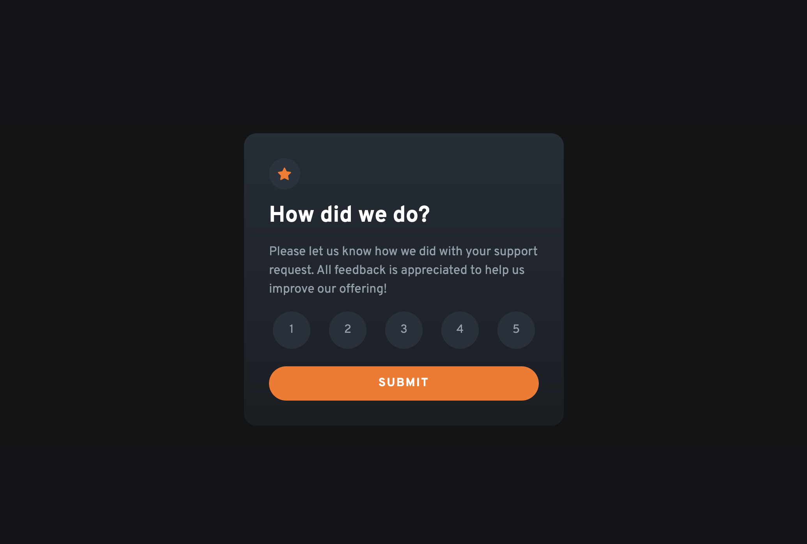

# Frontend Mentor - Interactive rating component solution

This is a solution to the [Interactive rating component challenge on Frontend Mentor](https://www.frontendmentor.io/challenges/interactive-rating-component-koxpeBUmI). Frontend Mentor challenges help you improve your coding skills by building realistic projects. 

## Table of contents

- [Overview](#overview)
  - [The challenge](#the-challenge)
  - [Screenshot](#screenshot)
  - [Links](#links)
- [My process](#my-process)
  - [Built with](#built-with)
  - [What I learned](#what-i-learned)

## Overview

### The challenge

Users should be able to:

- View the optimal layout for the app depending on their device's screen size
- See hover states for all interactive elements on the page
- Select and submit a number rating
- See the "Thank you" card state after submitting a rating

### Screenshot

### Links

- Solution URL: 
- Live Site URL:

## My process

### Built with

- Semantic HTML5 markup
- CSS custom properties
- Flexbox

### What I learned
This was another great challenge to improve upon my web development skills. I ran into a few problems that in resolving, gave me a better understanding in using css and javascript to make an interactive web page. When initially trying to create the buttons for selecting a rating, I tried to use divs as buttons. And when the each was clicked its place in the series of divs would be the rating. I found this to be overly complicated so instead I decided to use radio inputs. Only selecting one rating, used divs first but then used radio inputs to allow the user to select their rating in a form. This was easier in two ways: one, I could style the input label as a button and change a specific inputs style atrributes when they are hovered over and when selected. Two, when the selected rating was selected the radio inputs value could be added to the inner HTML in the thank you section. In future, I will try to learn more about forms and input elements and their application in more challenges

